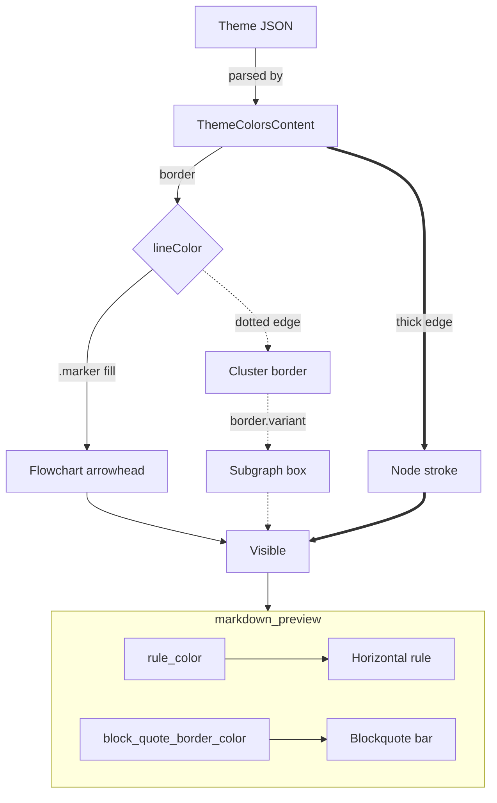
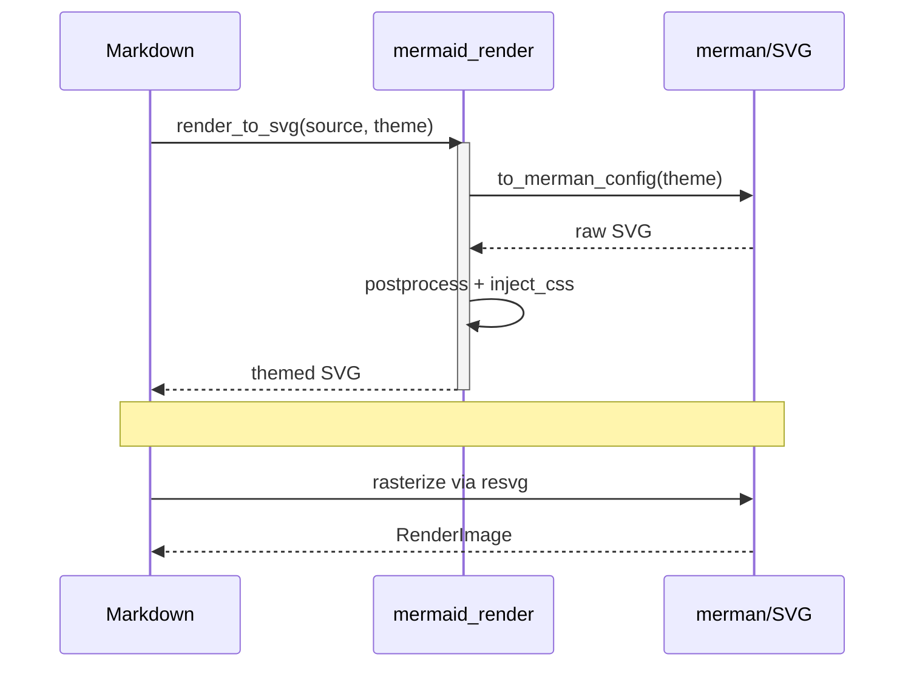

# Cyberpunk Neon — markdown torture fixture

Open this in Zed, run `markdown: open preview`, and check every element below in
**both** variants — then check the raw buffer too. Anything invisible means the
theme is wrong, not the fixture.

## H2 — inline styles

Body text with **bold**, *italic*, ***bold italic***, ~~strikethrough~~, and
`inline code` in one paragraph. Strikethrough is the sneaky one: Zed's own theme
has no `strikethrough` syntax key, so it falls back to `editor.foreground`.

### H3 — lists

- Unordered bullet, level one
- Second bullet
  - Nested bullet, level two
    - Nested bullet, level three
- Bullet with `code` and **bold** inside

1. Ordered item one
2. Ordered item two
   1. Nested ordered item
   2. Another nested ordered item
3. Ordered item three

- [x] Completed task
- [ ] Incomplete task
- [x] Completed task with **bold** and a [link](https://example.com)

#### H4 — table with alignment colons

| Left aligned | Centered | Right aligned | Notes |
|:-------------|:--------:|--------------:|:------|
| `punctuation` | pipes | 4.5:1 | pipes come from `border` |
| `title` | headings | 7.10:1 | orange, bold |
| `comment` | dim | 3.05:1 | load-bearing floor |
| `border` | strokes | 4.52:1 | arrowheads live here |

## Blockquotes

> A first-level blockquote. The vertical bar is painted by `border`.
>
> > A nested blockquote inside it. Both bars must be visible.
> >
> > - with a list inside the nested quote
> > - and a second item

## Horizontal rule

The rule below is `border` in the preview and `title` in the raw buffer:

---

## Links

An [inline link](https://github.com/Roboron3042/Cyberpunk-Neon) to the upstream
palette, an autolink <https://zed.dev/docs/extensions/themes>, an email autolink
<someone@example.com>, and a [reference link][zed].

[zed]: https://github.com/zed-industries/zed

## Fenced code blocks

```rust
/// Doc comment: exercises `comment.doc`.
#[derive(Debug, Clone)]
pub struct MermaidTheme {
    pub line_color: Hsla,   // <- paints flowchart arrowheads
    pub text_color: Hsla,   // <- paints sequence arrowheads
}

impl MermaidTheme {
    pub fn from_colors(colors: &ThemeColors) -> Self {
        let count = 0xea_00_d9_u32;
        Self { line_color: colors.border, text_color: colors.text }
    }
}
```

```python
# Comment: exercises `comment`.
from dataclasses import dataclass

@dataclass
class Palette:
    background: str = "#000b1e"
    foreground: str = "#0abdc6"

    def contrast(self, other: str) -> float:
        """Docstring exercises `string` + `comment.doc`."""
        return round(self.ratio(other), 2) if other else 0.0
```

```json
{
  "$schema": "https://zed.dev/schema/themes/v0.2.0.json",
  "name": "Cyberpunk Neon",
  "themes": [
    { "name": "Cyberpunk Neon Solid", "appearance": "dark", "escaped": "a \"quoted\" value" }
  ],
  "opacity": null,
  "translucent": false,
  "variants": 2
}
```

## Mermaid — flowchart

Every edge style below must show a visible line **and** a visible arrowhead.
Both come from `border`; the edge labels come from `text`.



## Mermaid — sequence diagram

Sequence arrows and arrowheads come from `text`, not `border`. Solid `->>` and
dashed `-->>` must both be visible, along with the actor boxes and lifelines.



## Footnote

Zed's markdown preview paints inline code over `editor.foreground` at 8% alpha[^1],
which is why `text.literal` alone is not enough to guarantee legibility.

[^1]: `crates/markdown/src/markdown.rs` — `background_color: Some(colors.editor_foreground.opacity(0.08))`.
